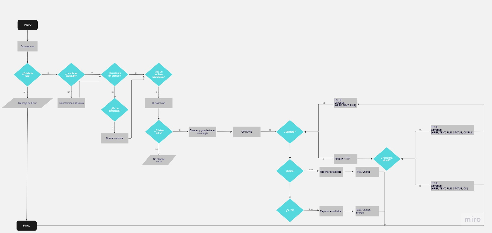
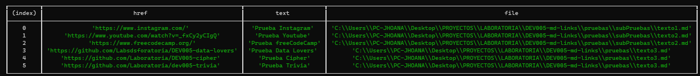
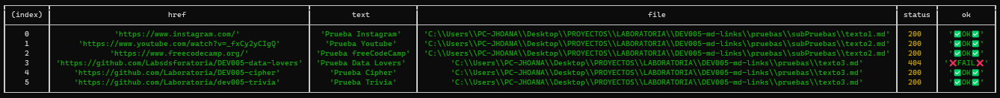
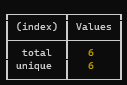
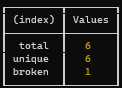

# Markdown Links

## Índice

- [1. Preámbulo](#1-preámbulo)
- [2. Resumen del proyecto](#2-resumen-del-proyecto)
- [3. Diagrama de flujo](#3-diagrama-de-flujo)
- [4. Guía de instalación](#4-guía-de-instalación)
- [5. Guía de uso](#5-guía-de-uso)

---

## 1. Preámbulo

Markdown es un lenguaje de marcado
ligero muy popular entre developers. Es usado en muchísimas plataformas que
manejan texto plano (GitHub, foros, blogs, ...) y es muy común
encontrar varios archivos en ese formato en cualquier tipo de repositorio
(empezando por el tradicional `README.md`).

Estos archivos `Markdown` normalmente contienen _links_ (vínculos/ligas) que
muchas veces están rotos o ya no son válidos y eso perjudica mucho el valor de
la información que se quiere compartir.

## 2. Resumen del proyecto

md-links es una librería desarrollada en Node.js que facilita la lectura y análisis de archivos con formato Markdown. Esta herramienta permite verificar los enlaces que se encuentran dentro de los archivos y generar informes detallados de estadísticas para su posterior análisis.

## 3. Diagrama de flujo



## 4. Guía de instalación

```sh
npm i JhoanaZF/DEV005-md-links
```

## 5. Guía de uso

- **Uso desde la línea de comandos:**
  El ejecutable de nuestra aplicación debe poder ejecutarse de la siguiente
  manera a través de la **terminal**:

`md-links <path-to-file>`

Por ejemplo:

```sh
$ md-links ./pruebas
```



El comportamiento por defecto no debe valida si las URLs responden ok o no,
solo identifica el archivo markdown (a partir de la ruta que recibe como argumento), analiza el archivo Markdown e imprime los links que vaya
encontrando, junto con la ruta del archivo donde aparece y el texto.

#### Options

##### `--validate`

Si pasamos la opción `--validate`, el módulo debe hacer una petición HTTP para
averiguar si el link funciona o no. Si el link resulta en una redirección a una
URL que responde ok, entonces consideraremos el link como ok.

Por ejemplo:

```sh
$ md-links ./pruebas --validate
```



Vemos que el _output_ en este caso incluye la palabra `ok` o `fail` después de
la URL, así como zel status de la respuesta recibida a la petición HTTP a dicha
URL.

##### `--stats`

Si pasamos la opción `--stats` el output (salida) será un texto con estadísticas
básicas sobre los links.

Por ejemplo:

```sh
$ md-links ./pruebas --stats
```



##### `--stats` `--validate`

También podemos combinar `--stats` y `--validate` para obtener estadísticas que
necesiten de los resultados de la validación.

Por ejemplo:

```sh
$ md-links ./pruebas --stats --validate
```



- **Uso desde una aplicación Node.js:**
  También puedes usar el módulo desde una aplicación Node.js. Para ello, importa la función mdLinks desde el módulo y llámala con los parámetros correspondientes:

` *import { mdLinks } from 'md-links';`

**Ejemplo:**

```sh
*mdLinks('<path-to-file-or-directory>', { validate: true})
.then(links => {
  console.log(links);
})
.catch(error => {
  console.error(error);
});*
```

**Donde:**

- `path-to-file-or-directory`: Ruta del archivo o directorio Markdown a analizar.
- `{ validate: true, stats: true }`: Objeto con opciones que permiten validar los links y obtener estadísticas de los mismos.
